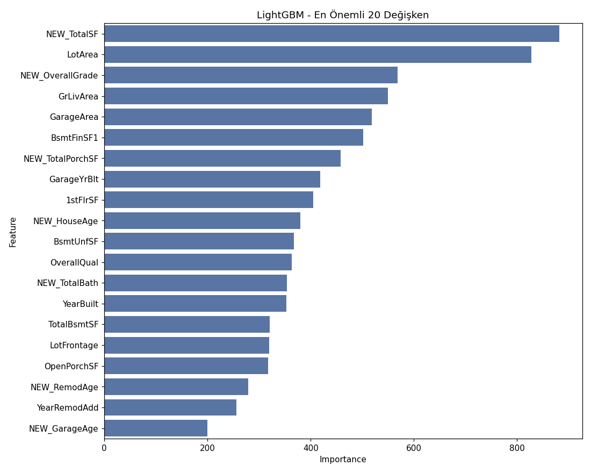
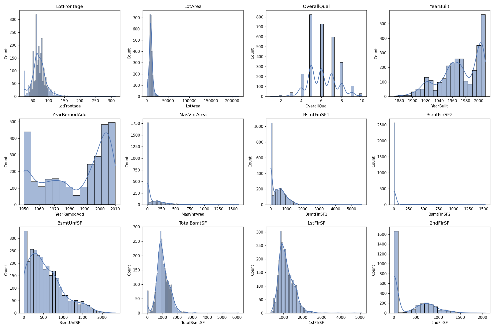

# 🏠 Ev Fiyat Tahmin Modeli (House Price Prediction)

Ames, Iowa'daki konut evlerine ait 79 açıklayıcı değişken kullanılarak ev satış
fiyatlarının tahmin edilmesi. Bu proje, **Miuul Data Scientist Bootcamp**
kapsamındaki Kaggle yarışması [House Prices - Advanced Regression Techniques
](https://www.kaggle.com/competitions/house-prices-advanced-regression-techniques)
üzerine kurulmuştur.

## 📌 İş Problemi

Her bir eve ait özelliklerin ve ev fiyatlarının bulunduğu veri seti kullanılarak,
farklı tipteki evlerin fiyatlarına ilişkin bir makine öğrenmesi projesi
gerçekleştirilmesi hedeflenmektedir.

## 🗂️ Veri Seti

| | |
|---|---|
| Gözlem sayısı | 1460 (train) + 1459 (test) |
| Açıklayıcı değişken | 79 |
| Sayısal değişken | 38 |
| Kategorik değişken | 43 |
| Hedef değişken | `SalePrice` |

Veri seti bir Kaggle yarışmasına ait olduğundan `train.csv` ve `test.csv` olmak
üzere iki dosyadan oluşur; test setinde `SalePrice` boş bırakılmıştır ve bu
projede tahmin edilmektedir. Veriyi kendiniz indirmek isterseniz:
👉 [Kaggle - House Prices: Advanced Regression Techniques](https://www.kaggle.com/competitions/house-prices-advanced-regression-techniques/data)

> `data/` klasörü, Kaggle yarışma kurallarına uygun olarak `.gitignore` ile
> repodan hariç tutulmuştur. Kodu çalıştırmadan önce `train.csv` ve `test.csv`
> dosyalarını Kaggle'dan indirip `data/` klasörüne yerleştirin.

## 🧭 Proje Adımları

### Görev 1 — Keşifçi Veri Analizi (EDA)
- Train ve test setlerinin birleştirilmesi
- `grab_col_names` ile numerik / kategorik / kardinal değişkenlerin yakalanması
- Tip düzeltmeleri (`MSSubClass`, `MoSold`, `YrSold` → kategorik)
- Numerik ve kategorik değişkenlerin dağılım analizi
- Kategorik değişkenler ile hedef değişken (`SalePrice`) incelemesi
- IQR tabanlı aykırı gözlem analizi
- Eksik gözlem analizi

### Görev 2 — Feature Engineering
- Eksik değerlerin değişken anlamına uygun şekilde doldurulması (ör. `PoolQC`,
  `Alley`, `FireplaceQu` gibi kolonlarda NaN = "özellik yok"; `LotFrontage`
  mahalle medyanı ile dolduruldu)
- Aykırı gözlemlerin eşik değerlerle baskılanması (winsorization)
- Rare Encoder (%1 altı sınıfların `"Rare"` olarak birleştirilmesi)
- Yeni değişkenler: `NEW_TotalSF`, `NEW_HouseAge`, `NEW_RemodAge`,
  `NEW_TotalBath`, `NEW_OverallGrade`, `NEW_TotalPorchSF`,
  `NEW_HasPool/Garage/Fireplace/Bsmt`, `NEW_Has2ndFloor`, `NEW_IsRemodeled`
- Label Encoding (ikili değişkenler) ve One-Hot Encoding (çok sınıflı
  değişkenler)

### Görev 3 — Model Kurma
- Train/Test ayrımı (`SalePrice` boş olan gözlemler test setidir)
- LightGBM ile baseline model ve 5 katlı çapraz doğrulama RMSE'si
- **Bonus:** Hedef değişkene log dönüşümü uygulanması ve tahminlerin
  `expm1` ile orijinal ölçeğe geri çevrilmesi
- `RandomizedSearchCV` ile hiperparametre optimizasyonu
- Değişken önem düzeyi analizi
- **Bonus:** Test setindeki boş `SalePrice` değerlerinin tahmini ve Kaggle'a
  submit edilebilir formatta `submission.csv` oluşturulması

## 📊 Sonuçlar

| Model | RMSE |
|---|---|
| Baseline LightGBM (log dönüşümsüz) | ~27,663 |
| Log dönüşümlü model (orijinal ölçek, validasyon) | ~24,217 |
| Optimize edilmiş model (5 katlı CV, log ölçeği) | **0.1243** |

En iyi hiperparametreler: `num_leaves=31, n_estimators=900, max_depth=5,
learning_rate=0.01, colsample_bytree=0.6`

En önemli 5 değişken: `NEW_TotalSF`, `LotArea`, `NEW_OverallGrade`,
`GrLivArea`, `GarageArea` — türetilen toplam kullanılabilir alan (`NEW_TotalSF`)
ve genel kalite×durum skoru (`NEW_OverallGrade`) modelin en güçlü
belirleyicileri arasına girmiştir.




Tam metrik özeti için: [`outputs/results_summary.txt`](outputs/results_summary.txt)
Kaggle submission dosyası: [`outputs/submission.csv`](outputs/submission.csv)

## ⚙️ Kurulum ve Çalıştırma

```bash
git clone https://github.com/<kullanici-adi>/house-price-prediction.git
cd house-price-prediction
pip install -r requirements.txt

# train.csv ve test.csv dosyalarını Kaggle'dan indirip data/ klasörüne koyun
python src/house_price_prediction.py
```

Script `data/train.csv` ve `data/test.csv` dosyalarını okur, uçtan uca
EDA → Feature Engineering → Model akışını çalıştırır ve `outputs/` klasörüne
görselleri, sonuç özetini ve `submission.csv` dosyasını yazar.

## 📁 Proje Yapısı

```
house-price-prediction/
├── data/                          # train.csv, test.csv (Kaggle'dan indirilecek, git'e dahil değil)
├── src/
│   └── house_price_prediction.py  # Uçtan uca EDA + FE + Model pipeline'ı
├── outputs/
│   ├── numeric_distributions.png
│   ├── feature_importance.png
│   ├── results_summary.txt
│   └── submission.csv
├── requirements.txt
├── .gitignore
├── LICENSE
└── README.md
```

## 🛠️ Kullanılan Teknolojiler

Python, pandas, NumPy, scikit-learn, LightGBM, matplotlib, seaborn

## 📄 Lisans

Bu proje [MIT Lisansı](LICENSE) ile lisanslanmıştır. Veri seti Kaggle'ın
kendi kullanım koşullarına tabidir.

---
*Miuul Data Scientist Bootcamp — Makine Öğrenmesi projesi kapsamında
hazırlanmıştır.*
